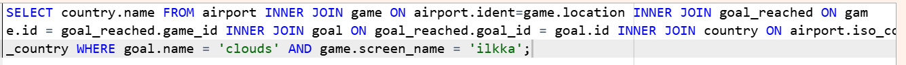

# Week 3
## Exercise 3 - Multiple table queries
### Question 1
SELECT country.name AS "country name", airport.name AS "airport name"  
FROM country JOIN airport ON country.iso_country = airport.iso_country  
WHERE country.name = 'Iceland';

### Question 2
SELECT airport.name AS "airport name"  
FROM airport INNER JOIN country  
ON airport.iso_country = country.iso_country  
WHERE country.name = 'France' AND airport.type = 'large_airport';

### Question 3
SELECT country.name AS "country_name", airport.name AS "airport_name" 
FROM airport INNER JOIN country  
ON airport.iso_country = country.iso_country  
WHERE country.continent = 'an';

### Question 4
select airport.elevation_ft from game, 
airport where airport.ident = game.location 
and game.screen_name = "heini"

### Question 5
select airport.elevation_ft * 0.3048 as elevation_m from game,
airport where airport.ident = game.location  
and game.screen_name = "heini";

### Question 6
select airport.name from game,
airport where airport.ident = game.location 
and game.screen_name = "Ilkka";

### Question 7
SELECT country.name FROM game 
JOIN airport ON airport.ident = game.location 
INNER JOIN country ON country.iso_country = airport.iso_country 
WHERE game.screen_name = "Ilkka";

### Question 8
select goal.name from goal
INNER JOIN goal_reached ON goal.id = goal_reached.goal_id 
INNER JOIN game on goal_reached.game_id = game.id
WHERE game.screen_name = "heini"

### Question 9
select airport.name FROM airport 
INNER JOIN game ON airport.ident = game.location   
INNER JOIN goal_reached ON game.id = goal_reached.game_id 
INNER JOIN goal ON goal_reached.goal_id = goal.id 
WHERE goal.name = 'clouds' AND game.screen_name = 'Ilkka';

### Question 10
SELECT country.name FROM airport  
INNER JOIN game ON airport.ident = game.location  
INNER JOIN goal_reached ON game.id = goal_reached.game_id  
INNER JOIN goal ON goal_reached.goal_id = goal.id  
INNER JOIN country ON airport.iso_country = country.iso_country  
WHERE goal.name = 'clouds' AND game.screen_name = 'Ilkka';

